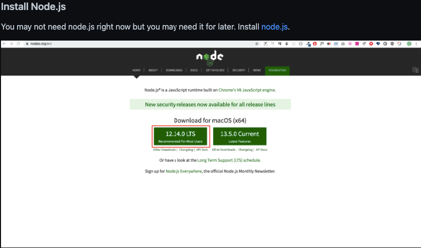
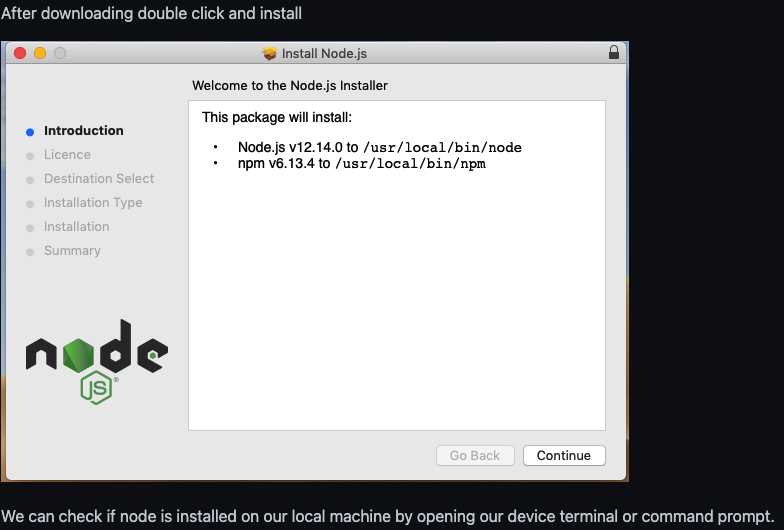
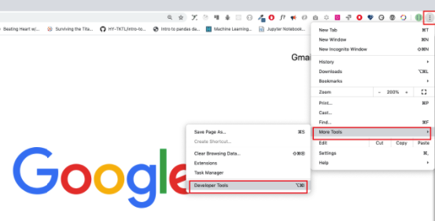
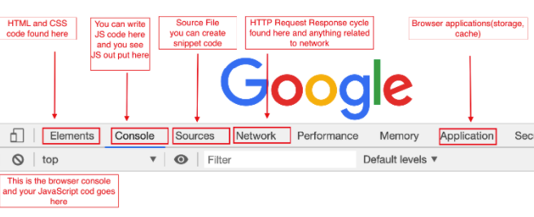
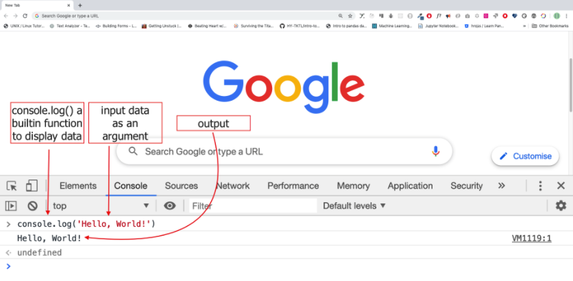

# Day 1 Introduction

## Setup

    <nombre_del_usuario>$ node -v
    v14.15.4
---
## Browser
#### Opening Google Chrome Console
"You can open Google Chrome console either by clicking three dots at the top right corner of the browser, selecting More tools -> Developer tools or using a keyboard shortcut. I prefer using shortcuts."

#### Developer tools description

"To open the Chrome console using a keyboard shortcut."
    
    Mac
    Command+Option+J

    Windows/Linux:
    Ctl+Shift+J

    In both
    F12

#### Console

---
