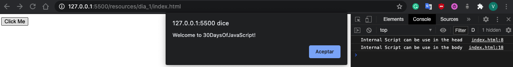

# Day 1 Introduction

## Setup

    <nombre_del_usuario>$ node -v
    v14.15.4

---

## Browser

#### Opening Google Chrome Console

"You can open Google Chrome console either by clicking three dots at the top right corner of the browser, selecting More tools -> Developer tools or using a keyboard shortcut. I prefer using shortcuts."

#### Developer tools description

"To open the Chrome console using a keyboard shortcut."

    Mac
    Command+Option+J

    Windows/Linux:
    Ctl+Shift+J

    In both
    F12

#### Console

## 

---

## Console.log()

    console.log('Hello, World!')

#### Console.log with Multiple Arguments.

    console.log('Hello', 'World', '!')
    console.log('HAPPY', 'NEW', 'YEAR', 2020)
    console.log('Welcome', 'to', 30, 'Days', 'Of', 'JavaScript')

#### Arithmetics

    console.log(2 + 3) // Addition
    console.log(3 - 2) // Subtraction
    console.log(2 * 3) // Multiplication
    console.log(3 / 2) // Division
    console.log(3 % 2) // Modulus - finding remainder
    console.log(3 ** 2) // Exponentiation 3 ** 2 == 3 * 3

---

## Comments

#### Example: Single Line Comment

    // This is the first comment

#### Example: Multiline Comment

    /_ This is a multiline comment
    Multiline comments can take multiple lines
    JavaScript is the language of the web
    _/

---

## Adding JavaScript to a Web Page

JavaScript can be added to a web page in three different ways:

- Inline script
- Internal script
- External script
- Multiple External scripts

#### Inline script

    <!DOCTYPE html>
    <html>
    <head>
        <title>30DaysOfScript:Inline Script</title>
    </head>
    <body>
        <button onclick="alert('Welcome to 30DaysOfJavaScript!')">Click Me</button>
    </body>
    </html>

<!DOCTYPE html>
<html>
  <head>
    <title>30DaysOfScript:Inline Script</title>
  </head>
  <body>
    <button onclick="alert('Welcome to 30DaysOfJavaScript!')">Click Me</button>
  </body>
</html>

#### Internal Script

    <!DOCTYPE html>
    <html>
    <head>
        <title>30DaysOfScript:Internal Script</title>
        
    </head>
    <body>
        
    </body>
    </html>

<!DOCTYPE html>
<html>
  <head>
    <title>30DaysOfScript:Internal Script</title>
    
  </head>
  <body>
    
  </body>
</html>

#### External Script

1.  Create a js file introduction.js and Add the following code:

        console.log('Welcome to 30DaysOfJavaScript')

2.  Add to the body of index.html this code. Note the link with de js script

        <!DOCTYPE html>
        <html>
          <body>
            //it could be in the header or in the body // Here is the recommended place
            to put the external script
            
          </body>
        </html>

#### Multiple External Scripts

1.  Create a js file hellopeque.js
2.  Put all the scripts that you want to link

        <!DOCTYPE html>
        <html>
          <body>
            
            
          </body>
        </html>

## Data Types

The following are JavaScript primitive data types:String, Number, Boolean, undefined, Null, and Symbol.

### Undefined

In JavaScript, if we don't assign a value to a variable, the value is undefined. In addition to that, if a function is not returning anything, it returns undefined.

    let firstName
    console.log(firstName) //not defined, because it is not assigned to a value yet

### Null

Null in JavaScript means an empty value.

    let emptyValue = null

### Checking Data Types

    console.log(typeof 'Asabeneh') // string
    console.log(typeof 5) // number
    console.log(typeof true) // boolean
    console.log(typeof null) // object type
    console.log(typeof undefined) // undefined

---

## Varaibles

To declare a variable, we use var, let, or const keywords.

A valid JavaScript variable name must follow the following rules:

- A JavaScript variable name should not begin with a number.
- A JavaScript variable name does not allow special characters except dollar sign and underscore.
- A JavaScript variable name follows a camelCase convention.
- A JavaScript variable name should not have space between words.

#### Declaration of Variable

Syntax

    let nameOfVariable = value

Declaring different variables of different data types

    let firstName = 'Asabeneh'
    let lastName = 'Yetayeh'
    let country = 'Finland'
    let city = 'Helsinki'
    let age = 100
    let isMarried = true

    console.log(firstName, lastName, country, city, age, isMarried)

Variables can also be declaring in one line separated by comma

    let name = 'Asabeneh', // name of a person
      job = 'teacher',
      live = 'Finland'
    console.log(name, job, live)
